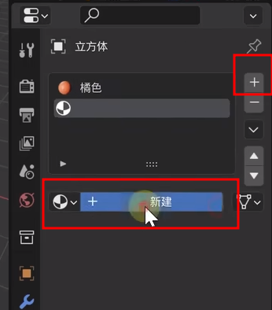
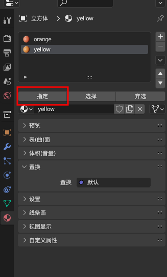
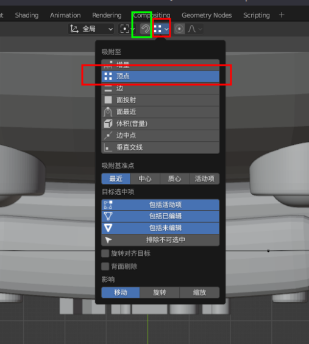

### 物体模式

1.  应用快捷键 Ctrl + A
2.  添加 Shift + A
3.  归零 Alt + R/G/S
4.  关联 Ctrl + L
5.  Shift + Z 线框模式
6.  Alt + Z  透显模式
7.  Shift + 鼠标右键 修改游标位置
8.  M 新建集合
9.  Ctrl + I 反选其他物体
10.  H 隐藏
11.  Alt + H 显示
12.  Ctrl + P 创建父子关系, 接触关系 Alt + P
13.  选中面光, Shift + T 调整面光方向跟随鼠标
14.  Ctrl + Alt + 0(小键盘) 调整摄像机视角到当前视角; 视图>>对齐视图>>活动摄像机对齐当前视角
15.  Ctrl + J 合并物体
16.  保持选中Shift + R 重复上次步骤,(用来快速复制物体)
16.  Ctrl + M 镜像 X|Y|Z

### 编辑模式 tab

1. Ctrl + B 倒角 配合滚轮增加分段
2. 边选择模式 Alt + 鼠标点击 环选
3. Ctrl + R 环选 配合鼠标滚轮增加环选
4. M 合并(重复的点)
5. I 内切面
6. E 挤出
7. Alt + E 挤出(按法相等)
8. F 从边创建面
9. Ctrl + I 反向选择
10. 合并之后的物体相关选择L
10. P 分离物体
10. L 选择相连元素

### 雕刻模式

1. Alt + Q 切换选中物体
1. Ctrl + 鼠标右键 断开关系

### 几何节点

1. 对齐欧拉至矢量: 旋转接口: 具体的数值; 矢量接口:物体的朝向
1. 预览 Ctrl + Shift + 鼠标左键
1. 获取几何图形的边>> 删除几何体[面,仅面]

### 技巧

1. 为同一物体设置不同材质,先设置一个材质,然后添加材质(两个加号),编辑模式选中另外一种材质的面,选择材质中的指定,修改第二个材质就会应用到选中的面.

2. 多个物体同时调整属性,按住Alt 在修改.

3. 对齐两个点(吸附工具): 选择吸附至定点,打开吸附工具, 选择一个点,G移动,选择另外一个点.

   

4. 摄像头焦距越小看到的视野越多.

5. 绑定骨骼: 在物体模式选中物体,加选(Shift)骨骼,切换到姿态模式(tab)选中单个骨骼绑定(Ctrl + P)>>骨骼

### 辣椒酱基础设置

界面》编辑器》状态栏》 全部勾选

界面》翻译》中文》 取消勾选 “新建数据”

视图切换》围绕物体旋转 | 自动深度

系统 》CUDA | Optix 

系统 》内存&限制》勾选全局撤销 

保存&加载》 自动运行Python脚本

插件》node wrangler | rigify

插件》导入导出 》 import image as planes  

插件》添加曲线 》 Extra Objects

插件》添加网格 》 BolfFactory | Extra Objects | A.N.T.Landscape

插件》界面 》 Modifier Tools | Copy Attributes Menu

插件》网格 》 LoopTools

插件》物体 》 BoolTool

插件》渲染 》 Cycles Render Engine

插件》UV 》 Magic UV
