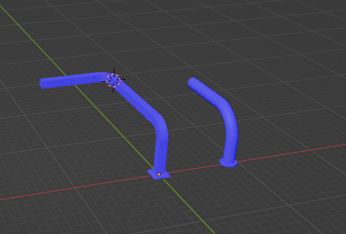

1. 编辑模式 点线面的快捷键1, 2, 3 同时开启多个模式 Shift + 1,2,3, 关闭 再次Shift + 1,2,3

2. 显示统计信息： 视图叠加层 》 统计信息

3. 内切 对于缺少面的边 内切面可以 忽略一个边"注意关闭 各面 选项"

4. 倒角偏移量和绝对值的区别： 

   指定倒角的材质： 

    倒角的缝合边 和 锐边 会把因为倒角断开的 缝合边和倒角拼接到一起

   形状：

   硬化法相：  如果物体已经自动平滑，开启硬化法相 会把倒角产生的面也平滑掉。

5. 顶点倒角 Control + Shift + B

6. 自动平滑， 与限制法相夹角

7. 编辑模式 Ctrl + Alt + 点击选择并排边

8. Ctrl + R 环切： 原理找到同一面的所有边排除相邻边既并排边，如果大于两个并排边或小于一个则结束寻找。并排边中间点连起来就是环切。均匀和反转的区别

9. 偏移环切边 Ctrl + Shift + R

10. 切割 K，  E 中断并继续切割， 双击闭合几何。C 角度限制， Z穿透切割

11. 切分 Shift + 8；先选中要切分的面， 在切分

12. 旋绕，编辑模式 旋绕，Alt + E 旋绕， 创建管道选中要选装的面，Shift + S 游标到选中项，将游标移动到面中心，旋绕，选择一个轴向，旋绕90度。