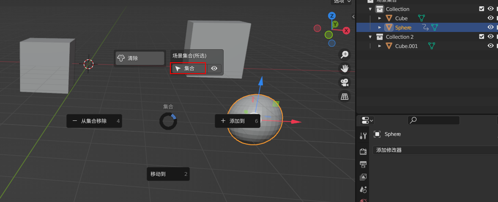

1. Ctrl + 1合并到末选点

2. Alt + 1 合并到路径 (注意顺序) 

3. 连接路径Ctrl + Alt + 1 

4. 滑动顶点 Shift + Alt + 1 

5. 智能边工具 Ctrl + 2 
   1. 如果选择的顶点小于2则切换到刻刀模式
   2. 如果选择的顶点大于2,且不同面则为连接顶点路径 
   3. 如果选择的顶点大于2,且同面则为连接顶点到最后选中的点 
   4. 边模式：选择独立的边为旋转边 
   5. 边或面模式：如果选择的是闭合的区域则为切换为选中的面或边  

6. Shift + 2 边模式标记(取消标记)锐边 

7. Alt + 2 边模式：偏移边线并滑移 

8. 
   1. 边模式：智能面工具 Ctrl + 3 (Alt + 双击选择循环边) 
   2. 点模式：选择两条边的拐点，Ctrl + 3 基于相邻两条边填充面
   3. 边模式： 选择一条边也会填充面，比F更智能，且会切换到下个可填充的边
   4. 面模式：独立话并切换到新的物体 

9. 清理优化 Ctrl + 4； 合并重复的顶点；独立的点，线，面；冗余的点，线，面；重新计算法线；

10. 加强版游标和原点工具: Shift + S 

11. 
    1. 对齐工具 Alt + A  
    2. 对齐物体到点 
    3. 网格对齐   
    4. 拉直 点模式：连接收尾两个点，其他点对齐到首尾的连线
       边模式(可以选择多个边)：会选择路径的首尾端点进行拉直
    5. 视图对齐: 切换到要对齐的视图
       
    6. 局部对齐 

12. 
    1. 镜像批量操作 Shift + Alt + X （以游标为基准 在按C, 删除模式 在按X）
    
    2. 批量取消同时选中， 右击
    

13. 聚焦显示 F, 局部显示 Ctrl + F, 推出局部显示 Ctrl + Alt + F

14. PageUp 渲染，显示综合 

15. 相机增强 PageDown (Alt + 点击智能视图相机 从当前视角创建相机)

16. 网格切割

     

17. 智能驱动和Unity导出器
    

    <video width="1280" controls>
      <source src="./video/2023-03-24_17-06-32.mp4" type="video/mp4"/>
    </video>

18. 集合快击键 Shift + C 快速全选物体所在集合的所有物体 

19. 打组Ctrl + G (会创建一个空物体，并设为父集) ；鼠标在 场景集合范围内 按1 切换组视图和完整视图， 2展开集合，3折叠结合

20. 添加螺纹，面数大于5。右击  

21. 游标旋绕 Alt + E (当面存在旋转时，将游标Shift + S 对齐旋转，选中要旋绕的物体， Alt + E)

     

22. 居中对齐 Alt + A

23. 投影切割 编辑模式，选择一个独立的图形，切换到对应的视图，Ctrl + 2

    

24. 点倒角 Ctrl + 1

    

25. 材质选择器 右击, 材质替换：选中物体->材质选择 ->Alt+点击新的材质物体 

    
    
26. n面板的按压 