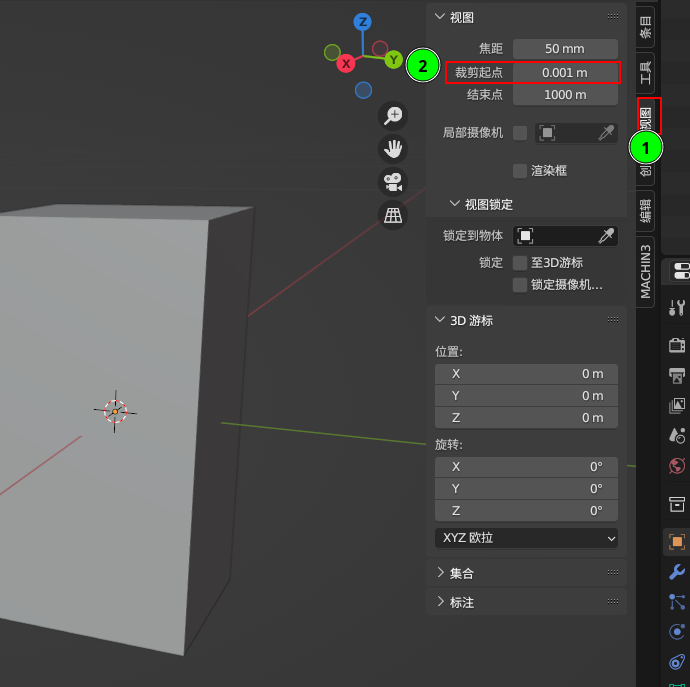

1. 修改物体大小 **N**，注意及时应用缩放，避免影响倒角效果(如果物体太小，修改之后看不到，修改视图里面的 裁剪起点 )
   1. 
   2. 
   3. 
2. **Ctrl + Alt + 点击** 选择所有的边 **Ctrl + B** 倒角，为了避免边面细分影响物体的形状在比较到的倒角时需要建立更多的分段. 面模式 选择上面倒角.
   1. 	
   2. 上材质
   3. 内切面，保证材质正确渲染 
   4. 上材质卡线,添加镜像修改器 
3. 追加(物体模式) USB A 母头模型， 切换到顶视图， 卡线
   1. 
   2. 选择中间面，挤出，扩选，倒角（倒角类型修改为圆弧）;  连接顶点，建立4边面，**Alt + A** 对齐移动的边
   3. 删除多余的面
   4. 对齐内凹的面
   5. 添加实例化修改器，增加厚度 
4. 创建插头
   1. 创建模型，修改大小，修改轮廓 
   2. 卡边线  
   3. 添加表面细分，平滑着色 
   4. 移动到底部，并卡线 
   5. 镜像并应用（使左边的线也卡住） 
   6. 复制一个副本，旋转隐藏到内部，并卡一条线到主体 
   7. 删除正面的面，挤出底部的面， 并通过对齐工具是挤出的面对齐卡的线 
   8. 面模式，扩选(**Ctrl + '+'**)，环切2 (**Ctrl + R**), 并将环切的线对齐外侧的线(**Alt + A**)
   9. 删除外侧的面，填充空白的面(**F**) 
   10. 2023-03-31_17-21.png卡线 