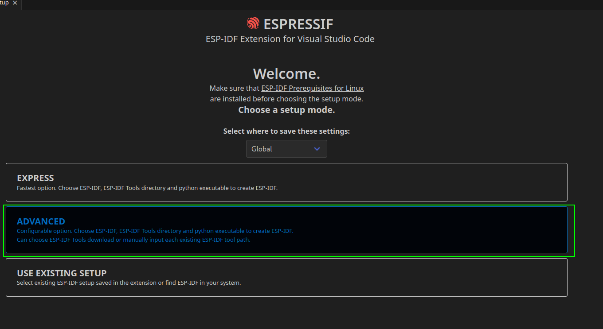
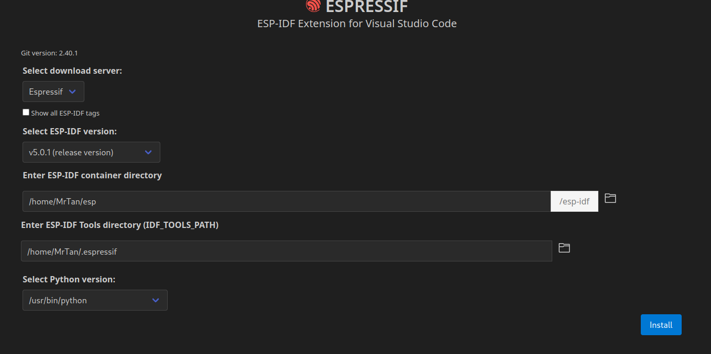
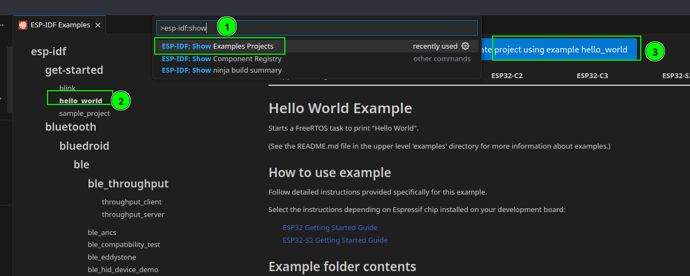
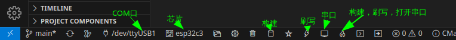
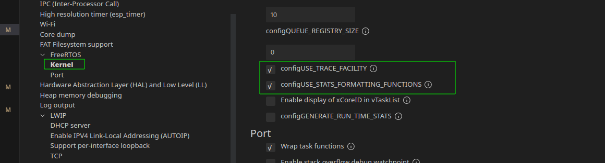

# Esp32 IDF 配置

1. VSCode 插件安装

   插件名称：Espressif IDF，安装完成之后选择 Advanced , 选择乐鑫官网，最新分支，安装。  

2. 创建hello_world模板项目

   `Ctrl + Shift + P` 打开VsCode命令行面板，输入esp-idf : show examples project 功能介绍：

   

3. [系统启动流程](https://docs.espressif.com/projects/esp-idf/zh_CN/v5.0.1/esp32c3/api-guides/startup.html)

4. 常用指令

   ```shell
   // 构建
   idf.py build 
   // 刷写
   idf.py flash
   // 终端 Ctrl + ] 退出
   /home/MrTan/.espressif/python_env/idf5.0_py3.11_env/bin/python /home/MrTan/esp/esp-idf/tools/idf_monitor.py -p /dev/ttyACM0 -b 460800 --toolchain-prefix riscv32-esp-elf- --target esp32c3 /home/MrTan/project/esp32c3/hello_world/build/hello_world.elf
   ```


5.  打印FreeRTOS 任务列表需要配置 
