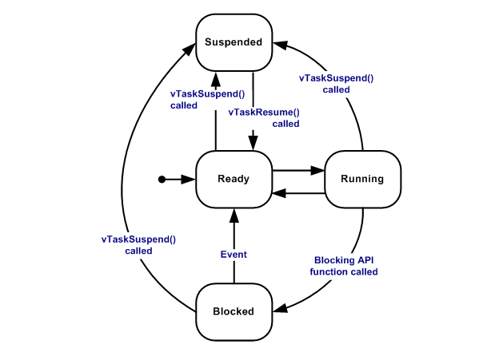

#  FreeRTOS 总结

### Task

1. 头文件 `task.h`

2. 创建  `xTaskCreate`

   | 参数                        | 含义               |
   | --------------------------- | ------------------ |
   | TaskFunction_t pvTaskCode   | 任务函数名         |
   | const char * const pcName   | 描述               |
   | unsigned short usStackDepth | 任务使用的栈深度   |
   | void *pvParameters          | 传入任务的参数指针 |
   | UBaseType_t uxPriority      | 优先级             |
   | TaskHandle_t *pxCreatedTask | 任务句柄的指针     |

   任务函数： 死循环，或者执行结束删除自己`vTaskDelete`

   描述： 后续可以通过`pcTaskGetName` 方法获取函数的描述

   任务参数：需要将参数的指针强制转换成 `void *` 类型， 在任务内部在转回对应的类型

   栈深度： 这个任务能使用的最大**字**，**字**与 MCU 相关， 可以通过 `uxTaskGetStackHighWaterMark` 获取运行时最小任务的栈剩余空间

   优先级：数字越高，优先级越高， 后续可以通过` vTaskPrioritySet` 设置， 通过 `uxTaskPriorityGet` 获取

   任务句柄：注意这是二级指针，不需要时传 `NULL`

3. 获取任务列表信息 `vTaskList` ，内容分别为 描述/状态/优先级/栈空间/唯一值

   ```
   Name            State   Priority    Stack    Num
   task_suspend_1  R       1       848     4
   task_suspend_4  R       1       860     5
   main            X       1       3480    2
   IDLE            R       0       1372    3
   esp_timer       S       22      3876    1
   ```

   

   任务状态 `X` -- 运行， `B` -- 阻塞， `R` --  就绪， `S` -- 阻塞， `D` -- 已删除(未被移除)

   

4. 任务的通知

   每个任务都有一个32位的通知值，初始值为0；`xTaskNotifyWait` 等待通知值的改变，`xTaskNotify` 设置通知的值， `xTaskNotifyGive`唤醒任务(通知值加1)， `ulTaskNotifyTake` 等待唤醒并获取通知值。

   1. xTaskNotifyWait

      | 参数                           | 含义             |
      | ------------------------------ | ---------------- |
      | uint32_t ulBitsToClearOnEntry  | 进入时清空的位   |
      | uint32_t ulBitsToClearOnExit   | 退出时清空的位   |
      | uint32_t *pulNotificationValue | 赋值通知值的指针 |
      | TickType_t xTicksToWait        | 最大Tick等待     |

   2. xTaskNotify

      | 参数                       | 含义                                                         |
      | -------------------------- | ------------------------------------------------------------ |
      | TaskHandle_t xTaskToNotify | 任务句柄                                                     |
      | uint32_t ulValue           | 更新通知的值                                                 |
      | eNotifyAction eAction      | 更新方式<br /> * eNoAction 唤醒任务但不修改通知值<br /> * eSetBits 通知值与ulValue按位或<br /> * eIncrement 通知的值自增<br /> * eSetValueWithOverwrite 用ulValue覆盖通知值<br /> * eSetValueWithoutOverwrite 如果通知已经有值待唤醒则返回失败，否则设置为ulValue |

   3. xTaskNotifyGive 使通知值自增

      | 参数                       | 含义     |
      | -------------------------- | -------- |
      | TaskHandle_t xTaskToNotify | 函数句柄 |

   4. ulTaskNotifyTake 当通知的值非0是唤醒

      | 参数                         | 含义                                                      |
      | ---------------------------- | --------------------------------------------------------- |
      | BaseType_t xClearCountOnExit | pdFALSE 退出时通知值自减<br />pdTRUE 退出时通知值设置为 0 |
      | TickType_t xTicksToWait      | 最大Tick等待                                              |

5. 任务的阻塞和恢复 `vTaskSuspend` 阻塞任务， `vTaskResume` 恢复任务，`xTaskResumeAll` 恢复所有任务， `vTaskSuspendAll` 阻塞所有任务，阻塞之后不能使用FreeRTOS的函数

6. 看门狗任务 `IDLE` 优先级为0, 如果其他任务一直执行， 5s 内`IDLE` 的不到执行会触发看门狗。`vTaskDelay` 可以让出时间片

### 队列 

1. 头文件`queue.h`
2. 创建 `xQueueCreate`， 参数为队列的长度和宽度
3. 发送数据 `xQueueSend`， 接收数据 `xQueueReceive`， 查询队列中项目的数量`uxQueueMessagesWaiting`
4. 邮箱：创建队列的长度为1， 写入数据使用 `xQueueOverwrite`， 读取使用 `xQueuePeek`
5. 多发送者单接收者， 需要将接收者的优先级调高
6. 队列集合：创建集合 `xQueueCreateSet`， 将队列加入集合 `xQueueAddToSet`, 从集合中挑选有数据的队列 `xQueueSelectFromSet`

### 信号量

1. 头文件`semphr.h`
2. 让出信号量 `xSemaphoreGive`， 获取信号量 `xSemaphoreTake`
3. 二进制信号量 `xSemaphoreCreateBinary`， 用于两个相同优先级的任务交替运行
4. 互斥信号量`xSemaphoreCreateMutex`， 类似于二进制信号量，但是如果**任务1**已经获取信号量，其他高优先级的**任务2**获取信号量时，**任务1**会临时提高到**任务二**的优先级。
5. 计数信号量 `xSemaphoreCreateCounting` 让出信号量会增加计数，获取信号量会减少计数，计数等于0时会阻塞获取信号量的任务。
6. 递归信号量 `xSemaphoreCreateRecursiveMutex`  用于锁定多个资源 获取信号量`xSemaphoreTakeRecursive` 让出信号量`xSemaphoreGiveRecursive`

### 软件定时器

1. 头文件`timers.h`

2. 创建定时器 `xTimerCreate`

   | 参数                                       | 含义                                    |
   | ------------------------------------------ | --------------------------------------- |
   | const char *pcTimerName                    | 描述                                    |
   | const TickType_t xTimerPeriod              | Tick 周期                               |
   | const UBaseType_t uxAutoReload             | pdFALSE 只执行一次<br />pdTRUE 周期执行 |
   | void * const pvTimerID                     | 标识唯一                                |
   | TimerCallbackFunction_t pxCallbackFunction | 执行的函数名                            |

3. 执行定时器`xTimerStart` ，结束定时器 `xTimerStop`， 删除定时器`xTimerDelete`，重置定时器计时 `xTimerReset` （如果在定时器执行前重置则执行函数将等不到执行类似看门狗），改变定时器的执行周期 `xTimerChangePeriod`

### 事件组

1. 头文件 `event_groups.h`

2. 事件组存储在一个8/24位的变量中通过设置对应的位和检查对应的位控制任务的执行

3. 等待事件组：一个任务等待其他任务(全部或任意任务设置)，设置位 `xEventGroupSetBits` ， 等待位设置 `xEventGroupWaitBits`

   | xEventGroupWaitBits参数              | 含义                                                        |
   | ------------------------------------ | ----------------------------------------------------------- |
   | const EventGroupHandle_t xEventGroup | 事件组                                                      |
   | const EventBits_t uxBitsToWaitFor    | 等待的位(如果等待多个位, 使用**位或**连接)                  |
   | const BaseType_t xClearOnExit        | pdTRUE 函数退出前清空等待的位<br />pdFALSE 不修改           |
   | const BaseType_t xWaitForAllBits     | pdTRUE 等待所有位都被设置<br />pdFALSE 任意位被设置都会唤醒 |
   | TickType_t xTicksToWait              | 等待Tick周期                                                |

4. 同步事件组：所有任务设置自己的位并等待其他任务设置 `xEventGroupSync`

   | 参数                              | 含义                                       |
   | --------------------------------- | ------------------------------------------ |
   | EventGroupHandle_t xEventGroup    | 事件组                                     |
   | const EventBits_t uxBitsToSet     | 设置的位                                   |
   | const EventBits_t uxBitsToWaitFor | 等待的位(如果等待多个位, 使用**位或**连接) |
   | TickType_t xTicksToWait           | 等待Tick周期                               |

### 流缓冲区

1. 头文件 `stream_buffer.h`

2. 将数据写入缓冲区或从缓冲区读取数据， 只要缓冲区的数据大于唤醒任务需要的大小就会唤起任务读取数据，如果读取数据buffer小于缓存区的数据会分包获取数据。

3. 创建 `xStreamBufferCreate`

   | 参数                      | 含义               |
   | ------------------------- | ------------------ |
   | size_t xBufferSizeBytes   | 缓冲区的大小       |
   | size_t xTriggerLevelBytes | 触发读操作的字节数 |

4. 发送数据 `xStreamBufferSend`， 读取数据 `xStreamBufferReceive`， 检查 `xStreamBufferSpacesAvailable` 缓冲区的剩余空间可以通过这个方法调整创建缓冲区的大小， `xStreamBufferIsFull` 缓冲区是否已经满， `xStreamBufferIsEmpty` 缓冲区是否为空

### 消息缓冲区

1. 头文件 `message_buffer.h`
2. 类似于 **流缓冲区**  不同点
   1. 创建时不需要设置触发字节数
   2. 一次接受一个消息
   3. 如果接受的buffer小于缓存区的一条消息的大小则读取失败
