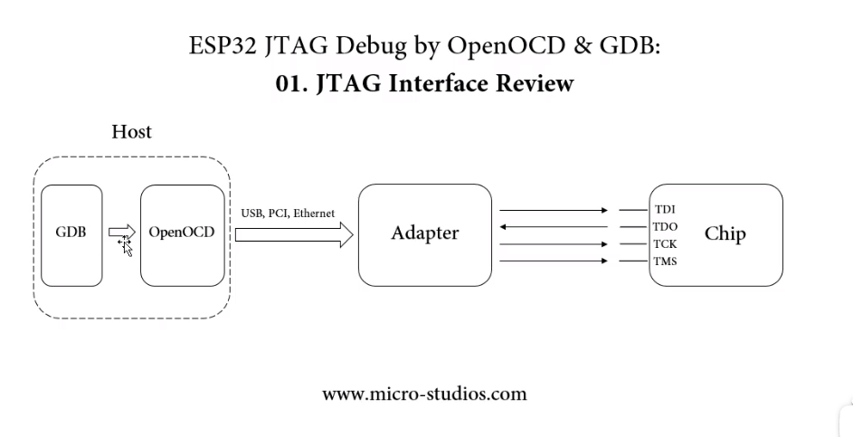
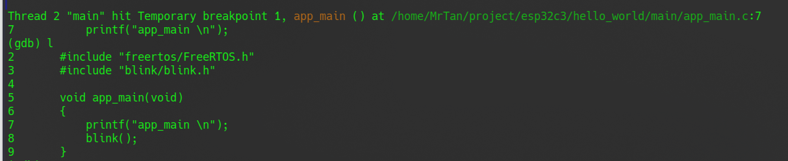
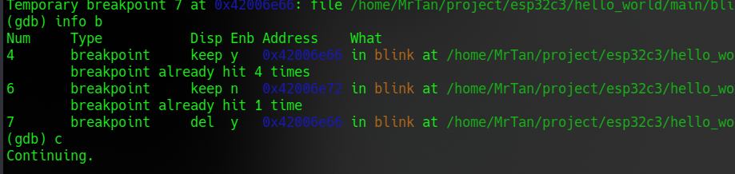
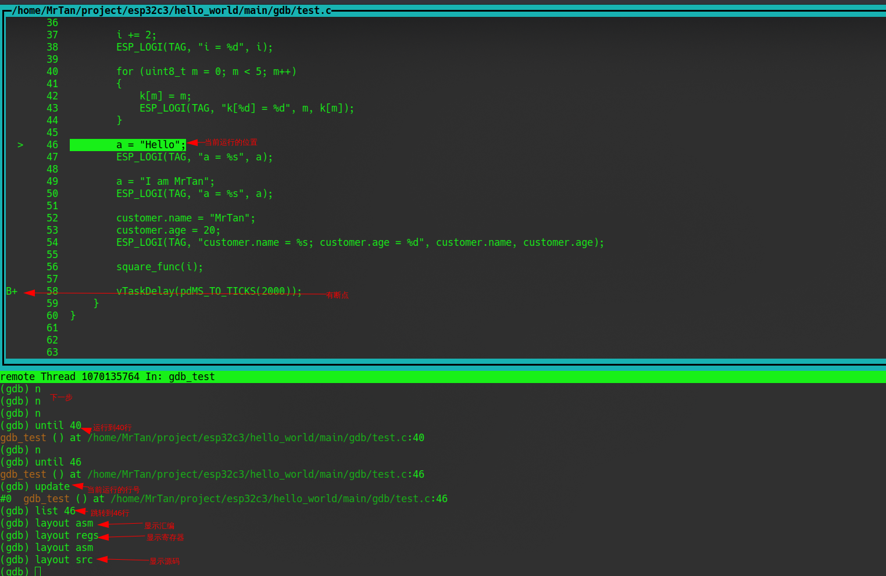

# JTAG 调试 



1. 启动idf环境 `. $HOME/esp/esp-idf/export.sh`

2. 启动openocd `openocd -f board/esp32c3-builtin.cfg`

   openocd 安装路径 `～/.espressif/tools/openocd-esp32/`

   脚本的目录 `～/.espressif/tools/openocd-esp32/v0.11.0-esp32-20221026/openocd-esp32/share/openocd/scripts/`

3. 编写 `DGB` 配饰参数，新建 `gdbinit` 文件 写入下列内容

   ```
   target remote :3333
   set remote hardware-watchpoint-limit 2
   mon reset halt
   flushregs
   thb app_main
   c
   ```

   - `set remote hardware-watchpoint-limit 2` — 限制 GDB 仅使用 ESP32-C3 支持的两个硬件观察点。更多详细信息，请查阅 [GDB 配置远程目标](https://sourceware.org/gdb/onlinedocs/gdb/Remote-Configuration.html) 。
   - `mon reset halt` — 复位芯片并使 CPU 停止运行。
   - `flushregs` — monitor (`mon`) 命令无法通知 GDB 目标状态已经更改，GDB 会假设在 `mon reset halt` 之前所有的任务堆栈仍然有效。实际上，复位后目标状态将发生变化。执行 `flushregs` 是一种强制 GDB 从目标获取最新状态的方法。
   - `thb app_main` — 在 `app_main` 处插入一个临时的硬件断点，如果有需要，可以将其替换为其他函数名。
   - `c` — 恢复程序运行，它将会在 `app_main` 的断点处停止运行。

4. 进入项目路径， 启动 `DGB`： `riscv32-esp-elf-gdb -x gdbinit build/hello_world.elf`

   GDB的安装路径： `～/.espressif/tools/riscv32-esp-elf-gdb/`

### 参数介绍

1. `c`  运行

2. `l` 查看停止的位置的代码

   

3. 停止运行 `Ctrl + c`

4. 退出 `q`

5. 创建断点 `b` 

   1. 在当前停止的文件上添加断点直接加行号`b 8`
   2. 给方法名添加断点加方法名: `b app_main`
   3. 在其他文件上加断点 文件名:行号 `b /home/MrTan/project/esp32c3/hello_world/main/blink/blink.c:20`
   4. 临时断点 `tb` (只执行一次，执行过后自动删除)
   5. 查看断点信息 `info b`   编号 / 类型 / 断点是否保持(临时/永久) / 是否有效 / 内存地址 / 描述  
   6. 断点生效/失效 `enable` `disable`  + 编号： `enable 4`
   7. 删除断点 `delete` + 编号: `delete 4`, 不加编号删除所有断点

6. 观察断点 `watch` ,观察的数据**变化**的时候会停止。

   1. 观察变量，直接加变量名: `watch i`
   2. 观察表达式: `watch i+j`

7. 打印 `print`

   1. 打印变量 i： `print i`

   2. 格式化打印 打印16进制的i: `print \x i`

      x: 16进制 | d：10进制 | u：无符号10进制 | o：8进制 | t：2进制 | a： 地址 | c： 字符 | f ：浮点数 | s：字符串

   3. 打印函数square_func中变量n的值: `print square_func::n `

   4. 打印文件中变量的值 `print '/home/MrTan/project/esp32c3/hello_world/main/gdb/test.c' :: i`

   5. 设置变量的值 `print i=6`

8. 显示 `display`，不主动停止运行代码， 断点停止的时候显示多个变量

   1. 显示不同格式的变量 参考 `print`： `display /x i `

   2. 显示 display 打印的值： `info display`

      ```
      (gdb) info display 
      Auto-display expressions now in effect:
      Num Enb Expression
      1:   y  i
      2:   y  /t j
      ```

   3. 不显示 `disable display 1`

   4. 显示 `enable display 1`

   5. 删除 `delete display 1`

9. 打印内存地址的内容 `x`, 调试库内容 `x /nfu <address>` 

   | 参数 | 含义                                                         |
   | ---- | ------------------------------------------------------------ |
   | n    | 打印的数量                                                   |
   | f    | 打印的格式（参考print）                                      |
   | u    | 一个单元占内存大小<br />b：一个字节Byte<br />h：半字（2字节）<br />w：一个字（4字节）<br />g：Gaint word（8字节） |

   ```
   (gdb) print a 
   $24 = 0x3c025b50 "I am MrTan"
   (gdb) print &i
   $25 = (uint8_t *) 0x3fc8c92c <i> "\024\006"
   (gdb) print &k
   $26 = (uint8_t (*)[5]) 0x3fc8c930 <k>
   (gdb)  x /10cb 0x3c025b50
   0x3c025b50:     73 'I'  32 ' '  97 'a'  109 'm' 32 ' '  77 'M'  114 'r' 84 'T'
   0x3c025b58:     97 'a'  110 'n'
   (gdb) x /10sb 0x3c025b50
   0x3c025b50:     "I am MrTan"
   0x3c025b5b:     ""
   0x3c025b5c:     "MrTan"
   0x3c025b62:     ""
   0x3c025b63:     ""
   0x3c025b64:     "\033[0;32mI (%lu) %s: customer.name = %s; customer.age = %d\033[0m\n"
   0x3c025ba2:     ""
   0x3c025ba3:     ""
   0x3c025ba4:     "rv_int_num != 0 && rv_int_num < RV_INT_COUNT && \"Invalid CPU interrupt number\""
   0x3c025bf3:     ""
   (gdb) x /1db 0x3fc8c92c
   0x3fc8c92c <i>: 20
   (gdb) x /5db 0x3fc8c930
   0x3fc8c930 <k>: 0       1       2       3       4
   ```

10. 设置

    1. 是否打印地址 `set print address on` `set print address off`

    2. 优化打印输出 `set print pretty on`

    3. 设置地址的前景/背景颜色 `set style address forground green` `set style address background red`

    4. 设置变量的值 `set variable i = 0` `set var j = 0`

    5. 设置环境变量 `set $a = 0`

       ```
       (gdb) set $a = 0
       (gdb) while($a < 5)
        >if(k[$a] == 3)
         >printf "$a = %d, find 3. \n", $a
         >end
        >set $a = $a + 1
        >end
       $a = 3, find 3.
       ```

11. 调试

    1. 运行N行 `next` / `n`， 运行3步 `next 3`, 不加参数运行1步
    2. 进入函数 `step` / `s`， 跳回 `finish`
    3. 运行到N行 `until`， 运行到 37行： `until 37`

12. 终端UI界面: 打开`tui enable`, 关闭 `tui disable` ，上下左右箭头调整显示区间。

    

13. 不运行直接跳转 `jump 行号` ，忽略一部分代码， 重复执行代码，运行到分支代码

14. 自定义命令 `define`, 查看定义的指令 `show user`

```
(gdb) define find_data_in_k_array
Redefine command "find_data_in_k_array"? (y or n) y
Type commands for definition of "find_data_in_k_array".
End with a line saying just "end".
>if($argc == 1)
 >set $a=0
 >while($a < 5)
  >if(k[$a] == $arg0)
   >print "id = %d, fing %d.\n", $a, $arg0
   >end
  >set $a = $a + 1
  >end
 >else 
 >print "wrong input paramter!\n"
 >end
>end
```

