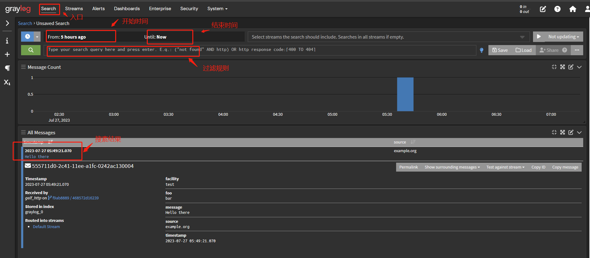

### WSL Docker 部署 Graylog

#### 容器遇到的问题：

1. parsing /home/mrtan/docker-graylog-compose.yml: yaml: line 6: mapping values are not allowed in this context
   问题描述：官方的graylog的compose配置 有几个配置没有添加空格区分层级，需要通过添加区别层级

2. error getting credentials - err: exec: "docker-credential-desktop.exe": executable file not found in $PATH, out: ``
   问题描述：缺少程序，需要到仓库 [docker-credential-helpers](https://github.com/docker/docker-credential-helpers)  下载最新的程序，并添加到系统环境中

3. mongodb 容器运行就结束，查看日志  `Operation not permitted`  
   问题描述：Windows和OS X上的默认Docker设置使用VirtualBox VM来托管Docker守护程序。不幸的是，VirtualBox用于在主机系统和Docker容器之间共享文件夹的机制与MongoDB使用的内存映射文件不兼容（请参阅vbox bug，docs.mongodb.org和相关的jira.mongodb.org错误）。这意味着无法运行映射到主机的数据目录的MongoDB容器。
   而且 wsl docker 会占用c盘的空间
   解决方案：迁移 docker镜像
   
   ```powershell
   // 打包当前的镜像
   wsl --export docker-desktop E:\docker\wsl\docker-desktop\docker-desktop.tar
   wsl --export docker-desktop-data E:\docker\wsl\docker-desktop-data\docker-desktop-data.tar
   //删除之前的镜像
   wsl --unregister docker-desktop-data 
   wsl --unregister docker-desktop-data
   //导入镜像
   wsl --import docker-desktop E:\docker\wsl\docker-desktop\ E:\docker\wsl\docker-desktop\docker-desktop.tar --version 2
   wsl --import docker-desktop-data E:\docker\wsl\docker-desktop-data\ E:\docker\wsl\docker-desktop-data\docker-desktop-data.tar --version 2
   ```

4. 最终启动文件
   
   ```yml
   version: '3'
   services:
   # MongoDB: https://hub.docker.com/_/mongo/
      mongo:
        container_name: mongo
        image: mongo:6.0.8
        volumes:
          - /etc/localtime:/etc/localtime
          - mongo_data:/data/db
        networks:
          - graylog
   # Elasticsearch: https://www.elastic.co/guide/en/elasticsearch/reference/7.10/docker.html
      elasticsearch:
        image: docker.elastic.co/elasticsearch/elasticsearch-oss:7.10.2
        container_name: elasticsearch
        environment:
          - http.host=0.0.0.0
          - transport.host=localhost
          - network.host=0.0.0.0
          - "ES_JAVA_OPTS=-Dlog4j2.formatMsgNoLookups=true -Xms512m -Xmx512m"
        volumes:
          - /etc/localtime:/etc/localtime
          - es_data:/usr/lib/elasticsearch/data
          - es_logs:/usr/lib/elasticsearch/logs
        ulimits:
         memlock:
          soft: -1
          hard: -1
        deploy:
         resources:
          limits:
           memory: 1g
        networks:
          - graylog
   # Graylog: https://hub.docker.com/r/graylog/graylog/
      graylog:
        image: graylog/graylog:5.1.3
        container_name: graylog
        environment:
   # 生成密码的指令 echo -n "Enter Password: " && head -1 < /dev/stdin | tr -d '\n' | sha256sum | cut -d " " -f1
   # CHANGE ME (must be at least 16 characters)!
         - GRAYLOG_PASSWORD_SECRET=somepasswordpepper
   # Password: admin
         - GRAYLOG_ROOT_PASSWORD_SHA2=8c6976e5b5410415bde908bd4dee15dfb167a9c873fc4bb8a81f6f2ab448a918
         - GRAYLOG_HTTP_EXTERNAL_URI=http://127.0.0.1:9000/
        entrypoint: /usr/bin/tini -- wait-for-it elasticsearch:9200 --  /docker-entrypoint.sh
        networks:
          - graylog
   #     restart: always
        depends_on:
          - mongo
          - elasticsearch
   # 端口配置, 如果需要开其他的端口,需要在这里增加
        ports:
   # Graylog web interface and REST API
          - 9000:9000
   # Syslog TCP
          - 1514:1514
   # Syslog UDP
          - 1514:1514/udp
   # GELF TCP
          - 12201:12201
   # GELF UDP
          - 12201:12201/udp
   networks:
    graylog:
      driver: bridge
   
   volumes:
    mongo_data:
    es_data:
    es_logs:
   ```

#### 配置

1. 开启 http 接口: System/Indices >> Inputs >> select input 选择 GELF HTTP 点击 Launch new input >> 输入 tiltle， 端口 保存

2. 设置定期(6个月，183天)删除日志： System/Indices >> Indices >> Default index set >> Edit
   
   1. Select rotation strategy >> Index Time
   
   2. Rotation period (ISO8601 Duration) >> P1D
   
   3. Select retention strategy >> Delete Index
   
   4. Max number of indices >> 183

3. 其他 集成Spring boot， 邮箱/http通知， 测试/正式分开， tcp/udp端口， rsyslog，  [参考文档](https://blog.csdn.net/liuyij3430448/article/details/127609313)

#### 使用

前面已经开启了 http 端口， 访问的地址: http://ip:port/grel 例如  http://192.168.20.64:12201/gelf  post请求方式。json 传输

| 字段            | 描述   |
| ------------- | ---- |
| short_message | 信息   |
| host          | 来源   |
| level         | 日志级别 |
| 其他自定义字段       |      |

检索日志： 

过滤规则 [官方文档](https://go2docs.graylog.org/5-1/making_sense_of_your_log_data/writing_search_queries.html?Highlight=queries)

  指定日志搜索时的关键字或条件表达式，可以是某个单独的“关键字”或“指定某个字段的值”。可以使用“AND”、“OR”、“NOT”进行多条件查询搜索

1. **模糊查询**：直接输入  baseid
2. **精确查询**：加引号   “baseid”
3. **字段查询**： team:base   其中 team 的值主要有 **base**
4. **多字段查询**：ztyq:(base-service base-web)
5. **多条件查询**：team:base AND ztyq:base-web OR source:192.168.0.4  
6. **正则匹配查询**：ztyq:base-web AND baseid:12?4*
7. 包含字段的查询： _exists_:type 
8. 数字的区间查询： http_response_code:[500 TO 504]


